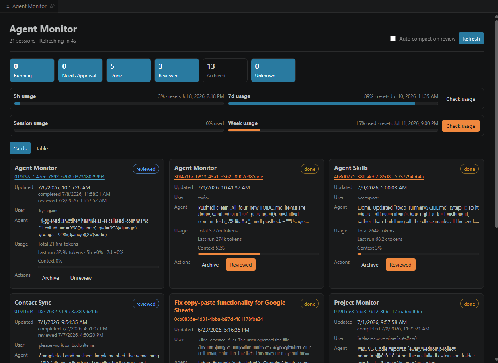
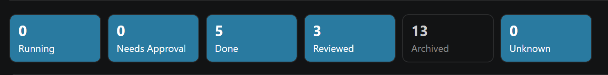
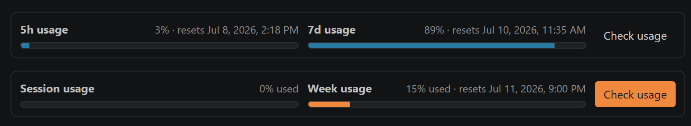
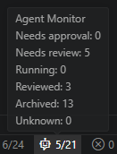

# Agent Monitor

A VS Code dashboard for keeping track of local <strong>Codex</strong> and <strong>Claude Code</strong> sessions - what's running, what's requesting approval, and what's already reviewed. Run `Hedron Agent Monitor: Open Dashboard` or click the robot <picture><source media="(prefers-color-scheme: light)" srcset="media/hubot-light.png"><source media="(prefers-color-scheme: dark)" srcset="media/hubot-dark.png"></picture> icon in the status bar.

  <picture>
    <source media="(prefers-color-scheme: light)" srcset="media/dashboard-light.png">
    <source media="(prefers-color-scheme: dark)" srcset="media/dashboard-dark.png">
    
  </picture>

## Overview

Hedron Agent Monitor scans local session data generated by Codex and Claude Code and presents the detected sessions in a single VS Code webview. It is intended for workflows that run multiple long-lived CLI agent sessions in terminal tabs and require a centralized way to determine which sessions are active, blocked, complete, reviewed, or archived.

## Features

- **Derived session status.** Sessions are classified as `running`, `needs approval`, `done`, `reviewed`, or `archived` based on transcript contents, recent file activity, completion markers, pending approval requests, and related process signals.

- **Session Status Filter.** The status cards on top are togglable status filters.

  <picture>
    <source media="(prefers-color-scheme: light)" srcset="media/statuscards-light.png">
    <source media="(prefers-color-scheme: dark)" srcset="media/statuscards-dark.png">
    
  </picture>

- **Codex and Claude Usage.** Codex usage is returned with every interaction, and can also be refreshed on demand with the "Check usage" button (queries the same usage endpoint the Codex CLI uses, authenticating with the CLI's own stored login). Claude usage is only refreshed when one uses "/usage" in an interactive session, or click the "Check usage" button.

  <picture>
    <source media="(prefers-color-scheme: light)" srcset="media/usage-light.png">
    <source media="(prefers-color-scheme: dark)" srcset="media/usage-dark.png">
    
  </picture>

- **Inline session actions.** Session cards provide actions for opening the associated terminal, approving pending tool calls, marking sessions reviewed, sending `/compact`, archiving, unarchiving, and deleting archived sessions.

- **Review state tracking.** Reviewed state is stored by the extension and is automatically cleared when new activity is detected for the corresponding session.

- **Optional compact-on-review.** When `agentMonitor.autoCompactOnReview` is enabled, marking a session reviewed also sends `/compact` to the associated terminal if its still open.

- **Status bar and notifications.** A VS Code status bar item summarizes the number of sessions requiring attention. Notifications can be emitted when a session transitions to a state that requires review or approval.

  <picture>
    <source media="(prefers-color-scheme: light)" srcset="media/statusbar-light.png">
    <source media="(prefers-color-scheme: dark)" srcset="media/statusbar-dark.png">
    
  </picture>

- **Archive lifecycle.** Archiving moves transcripts into the corresponding tool’s `archived_sessions` location. Archived sessions can be restored or permanently deleted.
