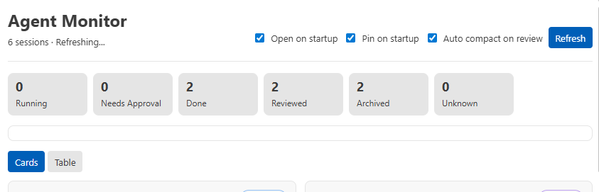

- [x] it gets stuck at "6 sessions · Refreshing..." forever. is it genuinly taking so much time? is something blocking it? what are the heavy operations? Can you confirm that it loops back to counting after it finishes refreshing?

The webview now resets the countdown after refresh failures/timeouts instead of staying on `Refreshing...`. Scan timing is exposed in the header tooltip. Current smoke scan: total 2677ms, index 14ms, transcripts 2561ms, process check 85ms, so transcript parsing is the heavy operation.

- [x] when i checked back at a later time, the weekly and 5hour limits bar have disappeared. can you check that they dont depend on any session being actively running? they should always be present, possibly referencing the latest token usage message across the sessions. 

The top usage bars now use the latest available `rate_limits.primary` and `rate_limits.secondary` from transcript `token_count` events, independent of whether a session is currently running. If a token event exists but one window is missing, that window remains visible as unavailable instead of disappearing.
- [x] add an approve button and always approve buttons on the needs approval notification, as well as change the "Reviewed" button on the page to the two buttons. which will send a y or p to that terminal respectively. for anything that is running, we can hide the reviewed button. the notification for approval should also include this part of the message (reason and the command also the name of the agent session) "  Reason: Allow reinstalling the packaged Project Monitor extension through the VS Code server.
 
  $ code --install-extension /home/django/everyhedron/project-monitor/project-monitor-0.0.10.vsix
  --force"
- [x] the reviewed tag should to cleared for a project if it ever becomes running after one marked it as reviewed.
- [x] to submit the compact command automatically, it should be "/compact" and enter, instead of /compact\n, which will paste in an actual newline
- [x] sometimes it still pops up a requires approval message after i have set something to alwasy approve. can you check for some example session histories in .codex, and see what the difference between an asking for approval than auto approved and an actually waiting for approval? maybe we can also find the settings file where the auto approvals are listed and compare?

Checked visible Codex config: `/home/django/.codex/config.toml` contains project trust settings, not per-command approval rules. Sampled transcript histories had 49 `require_escalated` calls and 0 without matching `function_call_output`. Pending approval detection is now stricter: an approval only counts as waiting if its unresolved call is newer than the latest user message, completion, and abort.

- [x] it'd be also nice to see, if in the updated section, it shows how many tokens that last one used, how many percentage of 5h and of 7h it used (if available) so user has more understanding of their token management.
- [x] for total tokens, use abreviated units such as 6k, 2m, 3g, etc. when hovering on that it will show exact number.
- [x] if a session is open in terminals, also expose a compact button on the card, that should submit "/compact" to that terminal
