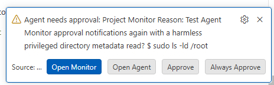
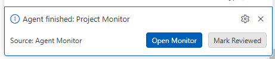

- [x]  we should make the notification for needing approval more beautiful. such as in the beginning just say which agents needs approval, then another line the reason (could be truncated), then the raw command on another line.

Codex response: Approval notifications now use separate lines: `Approval needed`, truncated `Reason`, and truncated `Command`, while keeping the monitor/open-agent/approve/always-approve actions. 
- [x]  for agent finished notification, we should have just which agent finished, a truncated version of its last message. and info in terms of its usage for the last run. and for buttons, we dont want the mark reviewd. we want an open agent button.

Codex response: Finished notifications now show the agent name, truncated last agent message, and last-run usage (`tokens`, `5h`, `7d`). Buttons are now `Open Monitor` and `Open Agent`; `Mark Reviewed` was removed.

- [ ] SKIP FOR NOW:   this is the current notification. just make it "Agent Name: the raw reason text without 'Reason:'" This could be different for claude, but implement with codex first.
- [x] for claude, if there is no user set session name, we can use "ai-title", but make it red.

Codex response: Confirmed via real transcripts that Claude writes a distinct `{"type":"ai-title","aiTitle":"..."}` event whenever no user-set name exists (`custom-title`/`agent-name` are absent, and are always identical to each other when a user does rename a chat). Name priority is now `customTitle > agentName > aiTitle > slug > sessionId`, and the card title renders in red (`--approval` red, reusing the existing needs-approval color) whenever the name came from `aiTitle`.

- [x] although claude does not have a native archive option, we can still implement archive/unarchive by moving to an archived session folder under .claude. 

Codex response: Added `archiveClaudeTranscript`/`unarchiveClaudeTranscript` in `claudeScanner.ts`. Archiving moves `~/.claude/projects/<project>/<id>.jsonl` to `~/.claude/archived_sessions/<project>/<id>.jsonl` (preserving the project subfolder name so unarchive can restore the exact original path); scanning now also walks `archived_sessions` and marks those sessions `status: "archived"`. Verified with a synthetic fixture in the scratchpad (round-trip archive → unarchive returned the exact original path).

- [x] implement delete for archived claude sessions by permanently deleting the project file, same confirmation.

Codex response: Added `deleteClaudeTranscript` (plain `fs.unlink`, no session-index cleanup needed since Claude has no equivalent central index) and a `deleteClaudeSession` dashboard action gated to `status === "archived"`, using the same modal "Permanently delete... This cannot be undone." confirmation as the Codex delete flow.

- [x] when archiving either codex or claude, if its currently opened in a terminal, pop up a message confirming the action, if confirmed, close that terminal.

Codex response: Added `Dashboard.confirmCloseTerminalIfOpen(terminalName)`, shared by both `archiveSession` (codex) and the new `archiveClaudeSession`. If a matching terminal is open it shows a modal ("... is currently open in a terminal. Archiving will close it. Continue?"); confirming disposes the terminal and proceeds with the archive, cancelling aborts the whole archive action.

- [x] for claude, also remove the Open button, its functionality is achieved by the link action on the id.

Codex response: Removed the standalone `Open` button from Claude cards; the id link (`renderOpenClaudeSessionLink`) already resumes the session via `openClaudeAgent`. The Actions row now only shows Compact/Archive or Unarchive/Delete, matching the Codex card's action set.

- [x] i know claude natively provides an idle tag, but we want it to say "done" as well.

Codex response: The Claude "idle" badge now labels as `done` (badge class stays `done-review`, matching the shared styling/filtering used by Codex's own "Done" bucket).

- [x] put claude cards and codex cards together, not in large separated sections. they should be organized alphabetically. remove the orange border on the left for claude cards, the orange id text is enough.

Codex response: Cards now render in a single combined grid sorted alphabetically by name (case-insensitive) across both Codex and Claude sessions; the separate "Claude Sessions" section is gone. The orange left border was removed — Claude cards now only get orange coloring on the session-id link (scoped via a `.card.claude` class instead of a section-level CSS variable override).

- [x] use the same compact function and logic for claude.

Codex response: Factored the compact flow into a shared `Dashboard.sendCompactToTerminal(terminalName, openIfMissing)` used by both `sendCompact` (codex) and the new `sendClaudeCompact` — same `/compact` + Enter terminal sequence, same "paste manually" fallback if the terminal isn't open.

- [x] in the .claude/sessions/<pid>.json file, this is an example where we can see the "{"pid":478889,"sessionId":"e4a73e5a-e985-4930-b421-9d16fb4b30de","cwd":"/home/django","startedAt":1783524910694,"procStart":"15809881","version":"2.1.204","peerProtocol":1,"kind":"interactive","entrypoint":"cli","name":"django-02","nameSource":"derived","status":"waiting","updatedAt":1783525652004,"statusUpdatedAt":1783525652004,"waitingFor":"permission prompt"}" waiting, which is requesting for approval.

Codex response: This was a real bug — `normalizeStatus` only ever matched `"busy"`/`"needs_input"`, but the live status file actually writes `"waiting"` (confirmed against real `~/.claude/sessions/*.json`), so every session waiting on approval or a dialog was silently falling through to `"idle"`. Fixed by mapping `"waiting"` (alongside `"needs_input"`) to `needs-input`; verified against a real live session currently in a "waiting"/"permission prompt" state, which now correctly shows the needs-approval badge.

**Usage limit / consumption**
- Claude: assistant message entries include a full `usage` object (`input_tokens`, `cache_creation_input_tokens`, `cache_read_input_tokens`, `output_tokens`, `iterations`, etc.) per turn, but nothing like Codex's rolling 5h/7d rate-limit-window percentages was found anywhere in the transcripts, settings, or cache dir — that data seems to live purely server-side / in the live UI, not persisted locally.
- Codex: writes `token_count` events with `rate_limits.primary` / `.secondary` (`used_percent`, `window_minutes`, `resets_at`) directly into the transcript, which is what today's usage bars in this extension read.

- [x] for claude, see if the usage object is enough to show per session total usage, last run (since last user message) usage, and context window. if so implement copying/reusing the codex display style but with the context bar orange. if not, respond below.

Codex response: Total and last-run usage are implemented — summed across all assistant `usage` entries (`input_tokens + cache_creation_input_tokens + output_tokens`), with the last-run counter resetting on each new (non-internal) user message. Each Claude card now shows a "Total / Last run / Context" usage block in the same `session-usage` style as Codex.

> Response: Context *window percentage* is not implemented as a bar. Codex can compute a percent because it explicitly writes `info.model_context_window` into the transcript; Claude's transcripts never include the model's max context size anywhere (checked transcripts, settings, and the local cache dir). The only way to get a percentage would be to hardcode a lookup table of context windows per model name, which would silently go stale or be wrong for beta/extended-context modes. Instead I show the raw "Context" token count (input + cache_creation + cache_read tokens from the latest assistant turn) without a percent/bar. Let me know if you'd like me to hardcode a per-model window table anyway (e.g. 200k for current Sonnet/Opus/Haiku) despite that risk.

- [x] on the status bar, there is an extra needs approval when no cards show as needs approval. fix if its an obvious bug, analyze if not. appears to me that its categorizing the done item as needs approval instead of needs review.

Codex response: Confirmed as a real bug — `updateStatusBar` computed `needsAttention = counts.needsApproval + counts.done` and displayed that single combined number next to the robot icon, so whenever there were "done" sessions but zero actual approvals pending, the status bar still showed a nonzero number that reads as "needs approval". Fixed by splitting the display: the alert icon + needs-approval count only appears when `counts.needsApproval > 0`, and the robot icon always shows `done/total` separately. The tooltip breakdown was already correct and is unchanged.

- [x] if when we click reviewed, the context is already 0%, we dont need to compact anymore.

Codex response: `markReviewed` now checks the session's context percent (via a shared `computeContextPercent` helper, factored out of the usage-bar rendering) before auto-compacting; if it's already exactly 0%, it skips `sendCompact`. If the percent is unknown, it still compacts (safe default, unchanged behavior).

- [x] put the placeholder claude usage strip right under codex usage strip.

Codex response: Moved `renderClaudeUsagePlaceholder()` to render immediately after `renderUsage(scan)` in the header, restoring the aggregate "Claude usage — not yet available" strip that was dropped when the card sections merged (the per-session usage added above is a different thing — real per-card token counts, not the unavailable aggregate 5h/7d-style rate limit).

- [x] include claude sessions to the status calculations on top and in status bar.

Codex response: Added a `combineSummaries` helper that folds Claude session counts into the same buckets used by the top stats row (`running`→running, `needs-input`→needs approval, `idle`→done, `archived`→archived; Claude has no reviewed/unknown equivalent so those stay Codex-only) and used it for the header's "N sessions" total and all six stat tiles. The VS Code status bar item's `DoneNotifier` now also scans Claude sessions each poll and folds them into the same counts shown in its text/tooltip.
